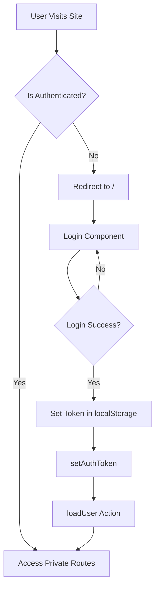

# Multivendor Admin - Routes Documentation

## Overview

This document provides a comprehensive overview of all routes in the Multivendor Admin application, including their purpose, access level, and flow.

## Table of Contents

1. [Route Types](#route-types)
2. [Authentication Routes](#authentication-routes)
3. [Dashboard & Profile](#dashboard--profile)
4. [Product Management](#product-management)
5. [Category Management](#category-management)
6. [Order Management](#order-management)
7. [Customer Management](#customer-management)
8. [Vendor Management](#vendor-management)
9. [Content Management](#content-management)
10. [Marketing & Promotions](#marketing--promotions)
11. [Site Configuration](#site-configuration)
12. [Return & Reviews](#return--reviews)

---

## Route Types

### BeforeLoginRoutes

- **Purpose**: Routes accessible only to non-authenticated users
- **Redirect**: Authenticated users are redirected away from these routes
- **Example**: Login page

### PrivateRoutes

- **Purpose**: Routes accessible only to authenticated users
- **Redirect**: Non-authenticated users are redirected to login
- **Protection**: Token-based authentication required

---

## Authentication Routes

### Login

- **Path**: `/`
- **Component**: `Login`
- **Type**: BeforeLoginRoutes
- **Description**: Main authentication entry point for the admin panel

---

## Dashboard & Profile

### Dashboard

- **Path**: `/dashboard`
- **Component**: `Dashboard`
- **Type**: PrivateRoutes
- **Description**: Main admin dashboard with overview statistics and metrics

### Profile

- **Path**: `/profile`
- **Component**: `Profile`
- **Type**: PrivateRoutes
- **Description**: Admin user profile management

### Vendor Profile

- **Path**: `/vendor-profile`
- **Component**: `VendorProfile`
- **Type**: PrivateRoutes
- **Description**: Vendor-specific profile view and management

---

## Product Management

### Products

Base path: `/products`

| Route                   | Component         | Type    | Description                                 |
| ----------------------- | ----------------- | ------- | ------------------------------------------- |
| `/products`             | `AllProducts`     | Private | List all products with filtering and search |
| `/products/add`         | `AddProduct`      | Private | Add new product form                        |
| `/products/bulk-upload` | `AddBulkProducts` | Private | Bulk product upload via CSV                 |
| `/products/:id/view`    | `ViewProduct`     | Private | View product details                        |
| `/products/:id/edit`    | `EditProduct`     | Private | Edit existing product                       |

**Flow**:

1. View all products → Click "Add" → Fill form → Submit
2. View all products → Select product → View/Edit → Update → Save
3. Bulk upload → Download template → Fill data → Upload CSV

---

## Category Management

### Main Categories

Base path: `/categorys`

| Route                 | Component      | Type    | Description              |
| --------------------- | -------------- | ------- | ------------------------ |
| `/categorys`          | `AllCategorys` | Private | List all main categories |
| `/categorys/add`      | `AddCategory`  | Private | Add new category         |
| `/categorys/:id/view` | `ViewCategory` | Private | View category details    |
| `/categorys/:id/edit` | `EditCategory` | Private | Edit category            |

### Sub Categories (Level 1)

Base path: `/sub-categories`

| Route                      | Component         | Type    | Description               |
| -------------------------- | ----------------- | ------- | ------------------------- |
| `/sub-categories`          | `AllSubCategorys` | Private | List all sub-categories   |
| `/sub-categories/add`      | `AddSubCategory`  | Private | Add new sub-category      |
| `/sub-categories/:id/view` | `ViewSubCategory` | Private | View sub-category details |
| `/sub-categories/:id/edit` | `EditSubCategory` | Private | Edit sub-category         |

### Sub-Sub Categories (Level 2)

Base path: `/sub-sub-categories`

| Route                          | Component            | Type    | Description                 |
| ------------------------------ | -------------------- | ------- | --------------------------- |
| `/sub-sub-categories`          | `AllSubSubCategorys` | Private | List all sub-sub-categories |
| `/sub-sub-categories/add`      | `AddSubSubCategory`  | Private | Add new sub-sub-category    |
| `/sub-sub-categories/:id/view` | `ViewSubSubCategory` | Private | View details                |
| `/sub-sub-categories/:id/edit` | `EditSubSubCategory` | Private | Edit sub-sub-category       |

### Sub-Sub-Sub Categories (Level 3)

Base path: `/sub-sub-sub-categories`

| Route                              | Component               | Type    | Description                 |
| ---------------------------------- | ----------------------- | ------- | --------------------------- |
| `/sub-sub-sub-categories`          | `AllSubSubSubCategorys` | Private | List all level 3 categories |
| `/sub-sub-sub-categories/add`      | `AddSubSubSubCategory`  | Private | Add new level 3 category    |
| `/sub-sub-sub-categories/:id/view` | `ViewSubSubSubCategory` | Private | View details                |
| `/sub-sub-sub-categories/:id/edit` | `EditSubSubSubCategory` | Private | Edit level 3 category       |

### Sub-Sub-Sub-Sub Categories (Level 4)

Base path: `/sub-sub-sub-sub-categories`

| Route                                  | Component                  | Type    | Description                 |
| -------------------------------------- | -------------------------- | ------- | --------------------------- |
| `/sub-sub-sub-sub-categories`          | `AllSubSubSubSubCategorys` | Private | List all level 4 categories |
| `/sub-sub-sub-sub-categories/add`      | `AddSubSubSubSubCategory`  | Private | Add new level 4 category    |
| `/sub-sub-sub-sub-categories/:id/view` | `ViewSubSubSubSubCategory` | Private | View details                |
| `/sub-sub-sub-sub-categories/:id/edit` | `EditSubSubSubSubCategory` | Private | Edit level 4 category       |

### Product Categories

Base path: `/productcategorys`

| Route                        | Component             | Type    | Description                 |
| ---------------------------- | --------------------- | ------- | --------------------------- |
| `/productcategorys`          | `AllProductcategorys` | Private | List all product categories |
| `/productcategorys/add`      | `AddProductcategory`  | Private | Add new product category    |
| `/productcategorys/:id/view` | `ViewProductcategory` | Private | View details                |
| `/productcategorys/:id/edit` | `EditProductcategory` | Private | Edit product category       |

**Category Hierarchy**:

```
Category (Level 0)
└── Sub-Category (Level 1)
    └── Sub-Sub-Category (Level 2)
        └── Sub-Sub-Sub-Category (Level 3)
            └── Sub-Sub-Sub-Sub-Category (Level 4)
```

---

## Order Management

### Orders

Base path: `/orders`

| Route               | Component    | Type    | Description                  |
| ------------------- | ------------ | ------- | ---------------------------- |
| `/orders`           | `AllOrders`  | Private | List all orders with filters |
| `/orders/add`       | `AddOrder`   | Private | Create new order manually    |
| `/orders/:id/view`  | `ViewOrder`  | Private | View order details           |
| `/orders/:id/track` | `TrackOrder` | Private | Track order shipment status  |
| `/orders/:id/edit`  | `EditOrder`  | Private | Edit order details           |

**Order Flow**:

1. Customer places order (frontend) → Appears in `/orders`
2. Admin views order → Updates status → Customer notified
3. Order tracking: `/orders/:id/track` → Shows shipment progress

---

## Customer Management

### Customers

Base path: `/customers`

| Route                 | Component      | Type    | Description                           |
| --------------------- | -------------- | ------- | ------------------------------------- |
| `/customers`          | `AllCustomers` | Private | List all customers                    |
| `/customers/add`      | `AddCustomer`  | Private | Add new customer                      |
| `/customers/:id/view` | `ViewCustomer` | Private | View customer details & order history |
| `/customers/:id/edit` | `EditCustomer` | Private | Edit customer information             |

---

## Vendor Management

### Vendors

Base path: `/vendors`

| Route               | Component    | Type    | Description                    |
| ------------------- | ------------ | ------- | ------------------------------ |
| `/vendors`          | `AllVendors` | Private | List all vendors               |
| `/vendors/add`      | `AddVendor`  | Private | Add new vendor                 |
| `/vendors/:id/view` | `ViewVendor` | Private | View vendor details & products |
| `/vendors/:id/edit` | `EditVendor` | Private | Edit vendor information        |

---

## Content Management

### Banners

Base path: `/banners`

| Route               | Component    | Type    | Description              |
| ------------------- | ------------ | ------- | ------------------------ |
| `/banners`          | `AllBanners` | Private | List all desktop banners |
| `/banners/add`      | `AddBanner`  | Private | Add new banner           |
| `/banners/:id/view` | `ViewBanner` | Private | View banner details      |
| `/banners/:id/edit` | `EditBanner` | Private | Edit banner              |

### Mobile Banners

Base path: `/mobilebanners`

| Route                     | Component          | Type    | Description             |
| ------------------------- | ------------------ | ------- | ----------------------- |
| `/mobilebanners`          | `AllMobilebanners` | Private | List all mobile banners |
| `/mobilebanners/add`      | `AddMobilebanner`  | Private | Add new mobile banner   |
| `/mobilebanners/:id/view` | `ViewMobilebanner` | Private | View banner details     |
| `/mobilebanners/:id/edit` | `EditMobilebanner` | Private | Edit mobile banner      |

### Blogs

Base path: `/blogs`

| Route             | Component  | Type    | Description         |
| ----------------- | ---------- | ------- | ------------------- |
| `/blogs`          | `AllBlogs` | Private | List all blog posts |
| `/blogs/add`      | `AddBlog`  | Private | Add new blog post   |
| `/blogs/:id/view` | `ViewBlog` | Private | View blog post      |
| `/blogs/:id/edit` | `EditBlog` | Private | Edit blog post      |

### Pages (Site Pages)

Base path: `/pages`

| Route             | Component      | Type    | Description           |
| ----------------- | -------------- | ------- | --------------------- |
| `/pages`          | `AllSitepages` | Private | List all static pages |
| `/pages/add`      | `AddSitepage`  | Private | Add new page          |
| `/pages/:id/view` | `ViewSitepage` | Private | View page content     |
| `/pages/:id/edit` | `EditSitepage` | Private | Edit page content     |

### Testimonials

Base path: `/testimonials`

| Route                    | Component         | Type    | Description           |
| ------------------------ | ----------------- | ------- | --------------------- |
| `/testimonials`          | `AllTestimonials` | Private | List all testimonials |
| `/testimonials/add`      | `AddTestimonial`  | Private | Add new testimonial   |
| `/testimonials/:id/view` | `ViewTestimonial` | Private | View testimonial      |
| `/testimonials/:id/edit` | `EditTestimonial` | Private | Edit testimonial      |

---

## Marketing & Promotions

### Coupons

Base path: `/coupons`

| Route               | Component    | Type    | Description                 |
| ------------------- | ------------ | ------- | --------------------------- |
| `/coupons`          | `AllCoupons` | Private | List all discount coupons   |
| `/coupons/add`      | `AddCoupon`  | Private | Create new coupon           |
| `/coupons/:id/view` | `ViewCoupon` | Private | View coupon details & usage |
| `/coupons/:id/edit` | `EditCoupon` | Private | Edit coupon                 |

### Collections

Base path: `/collections`

| Route                   | Component        | Type    | Description                  |
| ----------------------- | ---------------- | ------- | ---------------------------- |
| `/collections`          | `AllCollections` | Private | List all product collections |
| `/collections/add`      | `AddCollection`  | Private | Create new collection        |
| `/collections/:id/view` | `ViewCollection` | Private | View collection products     |
| `/collections/:id/edit` | `EditCollection` | Private | Edit collection              |

### Newsletters

Base path: `/newsletters`

| Route                   | Component        | Type    | Description                   |
| ----------------------- | ---------------- | ------- | ----------------------------- |
| `/newsletters`          | `AllNewsletters` | Private | List newsletter subscriptions |
| `/newsletters/add`      | `AddNewsletter`  | Private | Add newsletter entry          |
| `/newsletters/:id/view` | `ViewNewsletter` | Private | View newsletter details       |
| `/newsletters/:id/edit` | `EditNewsletter` | Private | Edit newsletter               |

---

## Site Configuration

### Menus

Base path: `/menus`

| Route             | Component  | Type    | Description                 |
| ----------------- | ---------- | ------- | --------------------------- |
| `/menus`          | `AllMenus` | Private | List all navigation menus   |
| `/menus/add`      | `AddMenu`  | Private | Create new menu             |
| `/menus/:id/view` | `ViewMenu` | Private | View menu structure         |
| `/menus/:id/edit` | `EditMenu` | Private | Edit menu items & hierarchy |

### Homepages

Base path: `/homepages`

| Route                 | Component      | Type    | Description                  |
| --------------------- | -------------- | ------- | ---------------------------- |
| `/homepages`          | `AllHomepages` | Private | List homepage configurations |
| `/homepages/add`      | `AddHomepage`  | Private | Create homepage layout       |
| `/homepages/:id/view` | `ViewHomepage` | Private | Preview homepage             |
| `/homepages/:id/edit` | `EditHomepage` | Private | Edit homepage layout         |

### Templates

Base path: `/templates`

| Route                 | Component      | Type    | Description         |
| --------------------- | -------------- | ------- | ------------------- |
| `/templates`          | `AllTemplates` | Private | List all templates  |
| `/templates/add`      | `AddTemplate`  | Private | Create new template |
| `/templates/:id/view` | `ViewTemplate` | Private | View template       |
| `/templates/:id/edit` | `EditTemplate` | Private | Edit template       |

### Settings

- **Path**: `/settings`
- **Component**: `Settings`
- **Type**: PrivateRoutes
- **Description**: Global site settings and configuration

---

## Product Attributes

### Colors

Base path: `/colors`

| Route              | Component   | Type    | Description            |
| ------------------ | ----------- | ------- | ---------------------- |
| `/colors`          | `AllColors` | Private | List all color options |
| `/colors/add`      | `AddColor`  | Private | Add new color          |
| `/colors/:id/view` | `ViewColor` | Private | View color details     |
| `/colors/:id/edit` | `EditColor` | Private | Edit color             |

### Sizes

Base path: `/sizes`

| Route             | Component  | Type    | Description           |
| ----------------- | ---------- | ------- | --------------------- |
| `/sizes`          | `AllSizes` | Private | List all size options |
| `/sizes/add`      | `AddSize`  | Private | Add new size          |
| `/sizes/:id/view` | `ViewSize` | Private | View size details     |
| `/sizes/:id/edit` | `EditSize` | Private | Edit size             |

### Variations

Base path: `/variations`

| Route                  | Component       | Type    | Description                 |
| ---------------------- | --------------- | ------- | --------------------------- |
| `/variations`          | `AllVariations` | Private | List all product variations |
| `/variations/add`      | `AddVariation`  | Private | Add new variation           |
| `/variations/:id/view` | `ViewVariation` | Private | View variation details      |
| `/variations/:id/edit` | `EditVariation` | Private | Edit variation              |

### Frames

Base path: `/frames`

| Route              | Component   | Type   | Description        |
| ------------------ | ----------- | ------ | ------------------ |
| `/frames`          | `AllFrames` | Public | List all frames    |
| `/frames/add`      | `AddFrame`  | Public | Add new frame      |
| `/frames/:id/view` | `ViewFrame` | Public | View frame details |
| `/frames/:id/edit` | `EditFrame` | Public | Edit frame         |

**Note**: Frames routes are public (not using PrivateRoutes)

---

## Return & Reviews

### Return Requests

Base path: `/return-requests`

| Route                       | Component           | Type    | Description              |
| --------------------------- | ------------------- | ------- | ------------------------ |
| `/return-requests`          | `AllReturnrequests` | Private | List all return requests |
| `/return-requests/add`      | `AddReturnrequest`  | Private | Create return request    |
| `/return-requests/:id/view` | `ViewReturnrequest` | Private | View return details      |
| `/return-requests/:id/edit` | `EditReturnrequest` | Private | Process return request   |

### Reviews

Base path: `/reviews`

| Route               | Component    | Type    | Description              |
| ------------------- | ------------ | ------- | ------------------------ |
| `/reviews`          | `AllReviews` | Private | List all product reviews |
| `/reviews/add`      | `AddReview`  | Private | Add review manually      |
| `/reviews/:id/view` | `ViewReview` | Private | View review details      |
| `/reviews/:id/edit` | `EditReview` | Private | Edit/moderate review     |

---

## Contact & Support

### Contacts

Base path: `/contacts`

| Route                | Component     | Type    | Description                |
| -------------------- | ------------- | ------- | -------------------------- |
| `/contacts`          | `AllContacts` | Private | List all contact inquiries |
| `/contacts/add`      | `AddContact`  | Private | Add contact manually       |
| `/contacts/:id/view` | `ViewContact` | Private | View contact details       |
| `/contacts/:id/edit` | `EditContact` | Private | Edit contact/add notes     |

### Franchises

Base path: `/franchises`

| Route                  | Component       | Type    | Description                     |
| ---------------------- | --------------- | ------- | ------------------------------- |
| `/franchises`          | `AllFranchises` | Private | List all franchise applications |
| `/franchises/add`      | `AddFranchise`  | Private | Add franchise entry             |
| `/franchises/:id/view` | `ViewFranchise` | Private | View franchise details          |
| `/franchises/:id/edit` | `EditFranchise` | Private | Edit franchise information      |

---

## Error Handling

### 404 - Page Not Found

- **Component**: `PageNotFound`
- **Type**: Public Route
- **Description**: Fallback route for all undefined paths
- **Behavior**: Displayed when user navigates to non-existent route

---

## Route Pattern Convention

All CRUD routes follow this standard pattern:

```
/{resource}              → List all (index)
/{resource}/add          → Create new
/{resource}/:id/view     → View single item
/{resource}/:id/edit     → Edit single item
/{resource}/:id/track    → Special action (e.g., order tracking)
```

---

## Authentication Flow



---

## Key Features

### Authentication

- Token stored in localStorage
- `setAuthToken` utility sets Axios default headers
- `loadUser` action validates token on app load
- Redux store manages auth state

### Route Protection

- **BeforeLoginRoutes**: Redirects authenticated users away
- **PrivateRoutes**: Requires authentication, redirects to login if not authenticated

### Navigation

- Menus are dynamically loaded
- Breadcrumb navigation throughout admin panel
- Side navigation with collapsible sections

---

## Environment & Configuration

### Dependencies

- React Router DOM v5 (BrowserRouter, Route, Switch)
- Redux for state management
- Axios for API calls

### Key Files

- `src/App.js` - Main route definitions
- `src/shared/Routes/BeforeLoginRoutes.js` - Public route wrapper
- `src/shared/Routes/PrivateRoutes.js` - Protected route wrapper
- `src/domain/setAuthToken.js` - Token management
- `src/store/actions/auth.js` - Authentication actions

---

## Notes

1. **Frames Routes**: Unlike other resources, Frames routes are public (don't use PrivateRoutes)
2. **Commented Routes**: Some page routes are commented out in the original code
3. **Deep Category Nesting**: Supports up to 5 levels of category hierarchy
4. **Bulk Upload**: Special route for bulk product uploads via CSV
5. **Order Tracking**: Dedicated route for shipment tracking separate from order view/edit

---

## Future Considerations

- Consider upgrading to React Router v6 for better performance
- Implement lazy loading for route components
- Add route-level permissions based on user roles
- Implement breadcrumb generation from route configuration
- Add route guards for specific vendor/admin permissions

---

**Last Updated**: November 4, 2025
**Version**: 1.0.0
